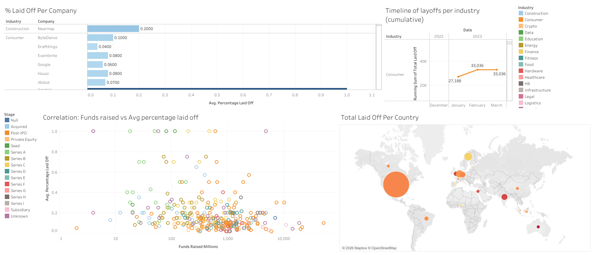

# cleaning-world-layoffs-data
# 📉 World Layoffs Data Cleaning Project

## 📌 Project Overview
This project focuses on cleaning a comprehensive dataset of tech company layoffs across the globe. Raw data is rarely ready for immediate analysis; it often contains duplicates, inconsistent naming conventions, and missing values. The goal of this project was to transform a "messy" layoffs dataset into a structured, reliable format suitable for Exploratory Data Analysis (EDA).

## 🛠️ Tech Stack & Tools
* **Language:** SQL (MySQL)
* **Tool:** MySQL Workbench

## 🧹 Data Cleaning Process
The cleaning process involved several distinct stages to ensure data integrity:

### 1. Remove Duplicates
Identified and removed duplicate entries by checking for identical rows across key columns (Company, Location, Industry, Total Laid Off, Percentage, and Date).
> **Method:** Used `ROW_NUMBER()` or `.duplicated()` to isolate and delete redundant records.

### 2. Standardize the Data
* **Trimming:** Removed unnecessary white spaces from company names.
* **Industry Alignment:** Standardized industry names (e.g., ensuring "Crypto", "CryptoCurrency", and "Crypto Currency" were all merged into one category).
* **Location Check:** Fixed inconsistent city or country names.
* **Date Formatting:** Converted the `date` column from text format to a `MM-DD-YYYY` date format to enable time-series analysis.

### 3. Handle Null and Blank Values
* Populated missing `industry` data by cross-referencing other entries for the same company.
* Identified rows where both `total_laid_off` and `percentage_laid_off` were null; these were deemed unusable for layoffs analysis and removed.

### 4. Remove Unnecessary Columns
Dropped helper columns used during the cleaning process (like row numbers) to keep the final dataset lean.

## 📊 World Layoffs Dashboard

See Live Demo here: [Live Demo](https://public.tableau.com/app/profile/ian.mairena.jarquin/viz/WorldLayoffs2022-2023/Dashboard1)
